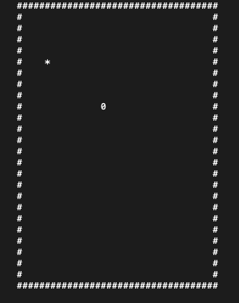

# Snake Game in Go

A classic Snake game implementation using Go, featuring terminal-based gameplay with smooth controls and simple mechanics.



## Installation

```bash
# Clone the repository
git clone https://github.com/rexposadas/snake.git

# Navigate to the project directory
cd snake

# Build the game
go build

# Run the game
./snake
```

## How to Play

Control the snake using the arrow keys:
- ↑ Move up
- ↓ Move down
- ← Move left
- → Move right
- `q` or `Ctrl+C` to quit

Collect food (represented by special characters) to grow longer. Avoid running into walls or your own tail!

## Development Status

The game currently includes:
- Basic snake movement
- Food collection
- Score tracking
- Collision detection

## Planned Features

- [ ] Multiple food items simultaneously
- [ ] Enemy obstacles
- [ ] Different game modes
- [ ] High score tracking
- [ ] Difficulty levels

## Contributing

Contributions are welcome! Feel free to:
1. Open an issue to discuss proposed changes
2. Submit a pull request with improvements
3. Report bugs or suggest features

## License

This project is open source and available under the MIT License.